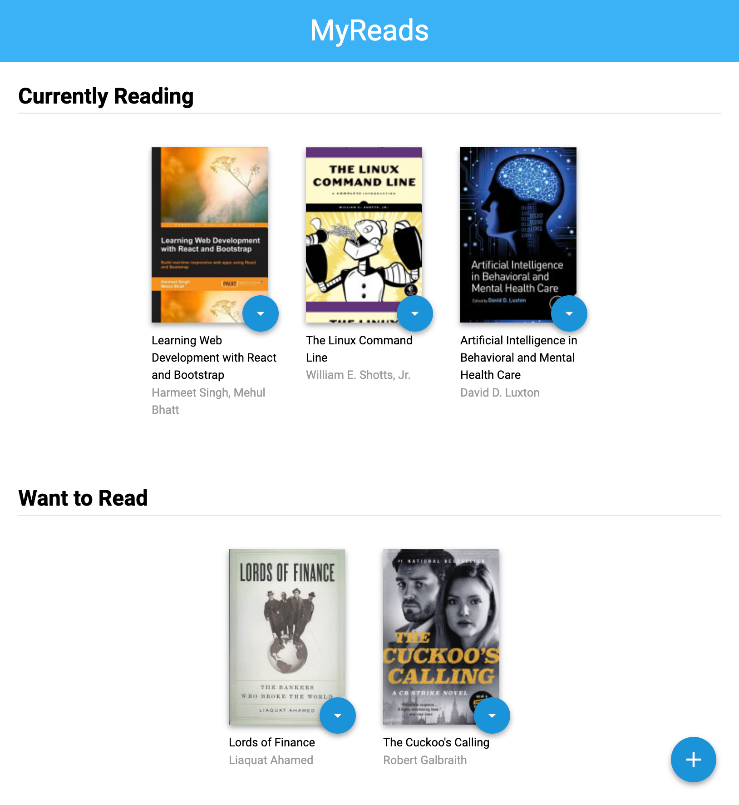

# "MyReads" React Application

Welcome to the "MyReads" React App! With this application, you will be able to keep track of your book reads. It comes with three different books shelves to manage; they are "Currently Reading", "Want to Read", and "Read".

You will also be able to search for books through an API that is a fixed set of cached search results (maximum of 20 books). When the search is empty, then by default, you will see all of your selected "MyReads" books.

## Installation Guide

To see this application:

* download files from this github repo and navigate to the files with your machine via terminal
* install all project dependencies with `npm install`
* simply start the development server with `npm start`

## Important

The backend API uses a fixed set of cached search results and is limited to a particular set of search terms, which can be found in [SEARCH_TERMS.md](SEARCH_TERMS.md). That list of terms are the _only_ terms that will work with the backend, so don't be surprised if your searches for Basket Weaving or Bubble Wrap don't come back with any results.

## Create React App

This project was bootstrapped with [Create React App](https://github.com/facebookincubator/create-react-app).
